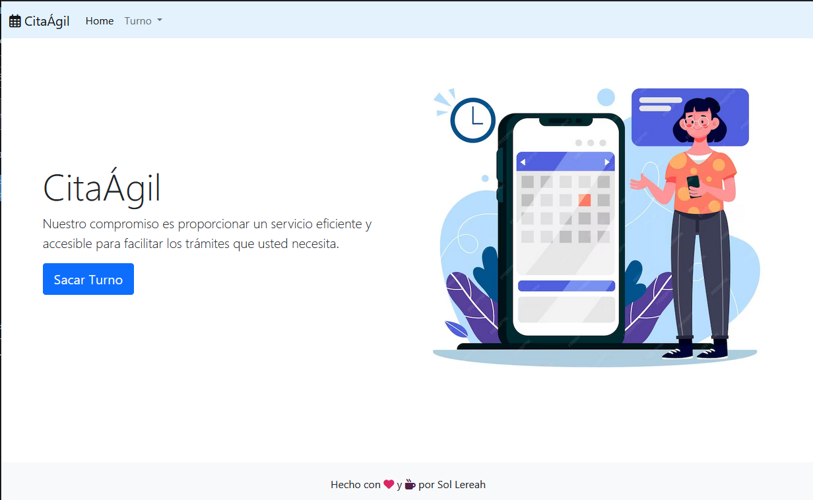
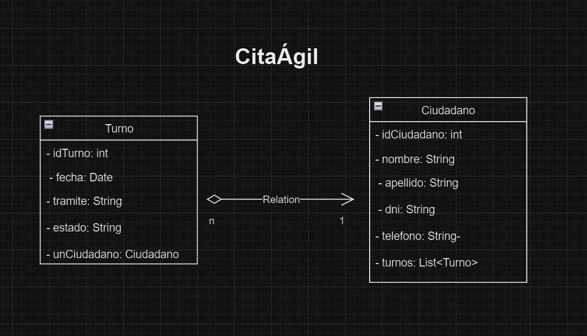
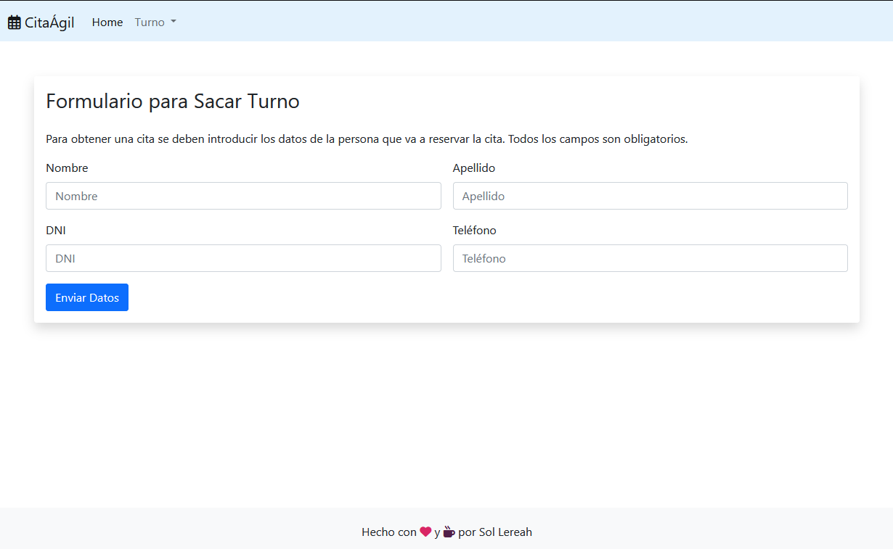
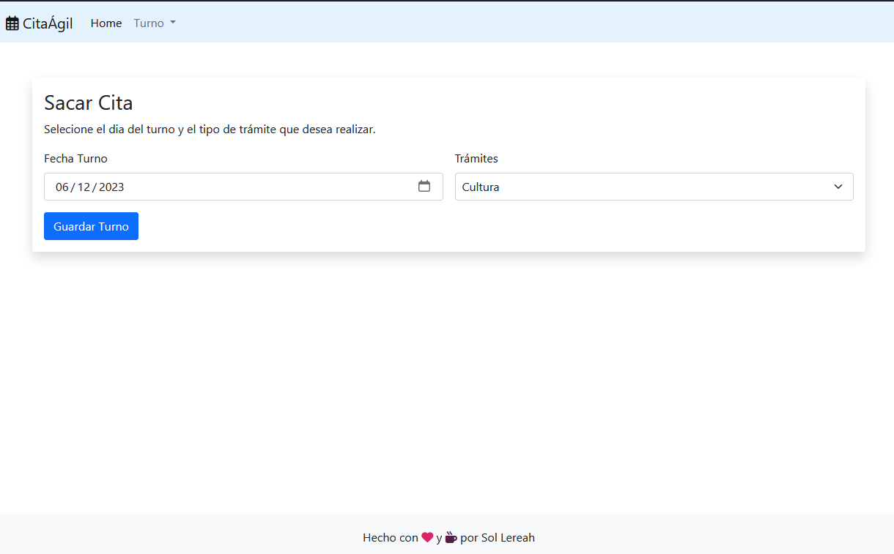
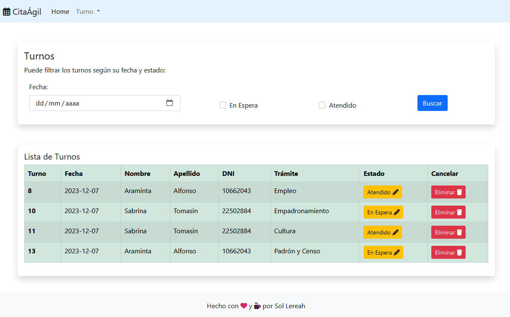

# CitaÁgil

Sistema de Gestión de Turnos
Este es un sistema de gestión de turnos que permite a los usuarios crear turnos, editar su estado de "En Espera" a "Atendido", y eliminar turnos. También cuenta con funciones de filtrado por fecha y estado de turno.

## Modelado de Clases

## Screenshots

## Uso

### Accede a la Aplicación:

#### Crear un Nuevo Turno:

Desde la interfaz principal, utiliza el formulario para crear nuevos turnos proporcionando la información requerida.

#### Editar el Estado de un Turno:

Desde la lista de turnos, utiliza la función de edición para cambiar el estado de un turno de "En Espera" a "Atendido".
Eliminar un Turno:

#### Eliminar un turno
Utiliza la función de eliminación para quitar un turno existente de la lista.

#### Filtrar por Fecha y Estado:
Utiliza los controles de filtrado para ver solo los turnos que coincidan con una fecha específica y/o estado.
