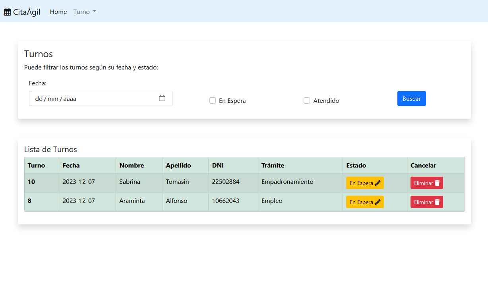

# CitaÁgil

### Sistema de Gestión de Turnos
Este es un sistema que permite a los usuarios crear turnos, editar su estado de "En Espera" a "Atendido" y eliminar turnos. También cuenta con funciones de filtrado por fecha y estado del turno.

## Modelado de Clases

## Screenshots

### Funcionalidades Principales:

#### Registro de Usuario:

- Los usuarios inician el proceso proporcionando información personal como nombre, apellido, DNI y número de teléfono.
- La aplicación valida los datos ingresados para garantizar su precisión y completitud.

#### Reserva de Turno:

- Después de registrar la información personal, los usuarios eligen la fecha y el horario disponibles para su trámite.
- Seleccionan el tipo de trámite que desean realizar.

#### Visualización de Turnos:

- Los usuarios pueden ver una lista de los turnos reservados.
- Pueden filtrar los turnos por fecha para ver los programados para un día específico.
- También tienen la opción de filtrar por estado, permitiéndoles ver los turnos en se encuentran en Espera o fueron Atendidos.

#### Cancelación de Turno:

- Se incluye la posibilidad de cancelar un turno programado si es necesario.
- Los usuarios pueden seleccionar un turno específico y cancelarlo, liberando ese horario para que otros usuarios lo reserven.

### Interfaz de Usuario:

- La interfaz de usuario es limpia y fácil de navegar, con formularios intuitivos para la entrada de datos y selección de turnos.
- Se utilizan elementos visuales claros para indicar el estado de los turnos (en espera, atendido).
- Las funciones de filtrado permiten a los usuarios acceder rápidamente a la información que necesitan.

### Tecnologías Utilizadas:

- La aplicación se desarrolla utilizando tecnologías web estándar, como Java para la lógica del servidor y JSP (JavaServer Pages) para la generación de vistas dinámicas.
- Se integran tecnologías front-end como HTML, CSS y Bootstrap para crear una interfaz atractiva y responsiva.
- Se utiliza MySQL como sistema de gestión de base de datos para almacenar y recuperar la información de los usuarios y turnos.
